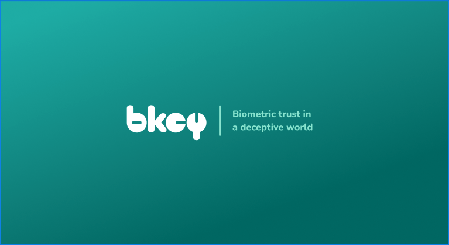

<a id="readme-top"></a>


<!-- PROJECT LOGO -->
<br />
<div align="center">
  <a href="https://github.com/github_username/repo_name">
    
  </a>

<h1 align="center">Bkey iOS SDK</h1>

  <p align="center">
    The Bkey iOS SDK provides a set of tools for integrating biometric authentication into your iOS applications. This SDK includes functionalities for enrolling and verifying users using biometric data.
    <br />
    <br />
  </p>
</div>


<br />

<!-- ABOUT THE PROJECT -->
## About The Project

As digital platforms become central to our lives, the need for biometric authentication that ensures true privacy is no longer a futuristic dream — it’s an urgent necessity. Traditional biometric authentication methods, which store sensitive data like facial signatures or fingerprints on external servers, expose us to significant privacy, identity, and security risks. These concerns highlight the need for a new approach to biometric authentication — one that truly safeguards our most personal information.

<br />

<!-- GETTING STARTED -->
## Getting Started

### Prerequisites

Add the sdk to your application using SPM.

Gain sdk access through a post request to: 
```sh
https://dev_api.davidpettey.com/authentication/v1/register
With a body field for name of your organization

Response will be in the form:{
    "clientId": "x-x-x-x-x",
    "clientSecret": "x-x-x-x-x"
}

You then need to reach out to activate the account. 
```

### Usage

1. Import the BkeyiOS class
   ```sh
   import Bkey
   
   let bkeySDK = BkeyiOS.shared
   ```
<br>

2. Set credentials
   ```sh
   bkeySDK.SetCredentials(clientId:String, clientSecret:String)
   ```
<br>

3. Enroll a user. 
   ```sh
   import SwiftUI

   struct ContentView: View {
        var body: some View {
            bkeySDK.Enroll(deviceId: "optional identifier", password: "optional password") { bioHash in
                // Handle the bioHash
            }
        }
   }
   ```
<br>

4. Verify a user.
   ```sh
   import SwiftUI

   struct ContentView: View {
        var body: some View {
            bkeySDK.Verify(deviceId: "optional identifier", password: "optional password", bioHash: [/* bioHash data */]) { isSuccess in
                // Handle the verification result
            }
        }
   }
   ```
<br>

After a user is enrolled or verified. Functionality opens up to be able to perform actions with the biometrics that the user has just presented. 

### Encrypt / Decrypt String
```sh
do {
    // Encrypt a string
    let encryptedString = try bkeySDK.EncryptString(value: "Hello, World!")
    print("Encrypted String: \(encryptedString)")
    
    // Decrypt the string
    let decryptedString = try bkeySDK.DecryptString(value: encryptedString)
    print("Decrypted String: \(decryptedString)")
} catch {
    print("Encryption/Decryption Error: \(error)")
}
```

### Encrypt / Decrypt Data
```sh
do {
    // Encrypt data
    let dataToEncrypt = "Hello, World!".data(using: .utf8)!
    let encryptedData = try bkeySDK.EncryptData(data: dataToEncrypt)
    print("Encrypted Data: \(encryptedData)")
    
    // Decrypt the data
    let decryptedData = try bkeySDK.DecryptData(data: Data(encryptedData))
    let decryptedString = String(decoding: decryptedData, as: UTF8.self)
    print("Decrypted Data: \(decryptedString)")
} catch {
    print("Encryption/Decryption Error: \(error)")
}
```

<p align="right">(<a href="#readme-top">back to top</a>)</p>


### Sign / Verify String
```sh
Task{
    do {
        let signature = try await BkeyiOS.shared.SignString(value: "Hello, World!")
        print("Signed String: \(signature)")
        
        let publicKey = await CreatePublicKey() // replace with other public key if needed
        
        let isVerified = try await BkeyiOS.shared.VerifyStringSignature(value: "Hello, World!", signature: signature, publicKey: publicKey)
        print("Signature Verified:",isVerified)
    } catch {
        print("Sign/Verify Error: \(error)")
    }
}
```

### Sign / Verify Data
```sh
Task{
    do {
        let dataToSign = "Hello, World!".data(using: .utf8)!
        let signature = try await BkeyiOS.shared.SignData(data: dataToSign)
        print("Signed Data: \(signature)")
        
        let publicKey = await CreatePublicKey() // replace with other public key if needed
        
        let isVerified = try await BkeyiOS.shared.VerifyDataSignature(data: dataToSign, signature: signature, publicKey: publicKey)
        print("Signature Verified:",isVerified)
    } catch {
        print("Sign/Verify Error: \(error)")
    }
}
```

<p align="right">(<a href="#readme-top">back to top</a>)</p>


## Create Keys

### Public Key
```sh
    let key = try await BkeyiOS.shared.CreatePublicKey()
    print("Public Key:",key)
```

### Private Key
```sh
    let key = try await BkeyiOS.shared.CreatePrivateKey()
    print("Private Key:",key)
```

### AES 128
```sh
  let key = try await BkeyiOS.shared.CreateAes128Key()
  print("Aes 128 Key:",key)
```

### AES 256
```sh
  let key = try await BkeyiOS.shared.CreateAes256Key()
  print("Aes 256 Key:",key)
```

### Alphanumeric
```sh
  let key = try await BkeyiOS.shared.CreateAlphaNumeric(size: 32)
  print("Alphanumeric Key:",key)
```

<p align="right">(<a href="#readme-top">back to top</a>)</p>

<!-- ROADMAP -->
## Roadmap

- [X] Authentication 
- [X] Biometrically encrypt and decrypt data
- [X] Biometrically sign and verify data
- [X] Biometric key generation


<p align="right">(<a href="#readme-top">back to top</a>)</p>

## Bugs / Feature Requests
Email: david.pettey@bkey.me
